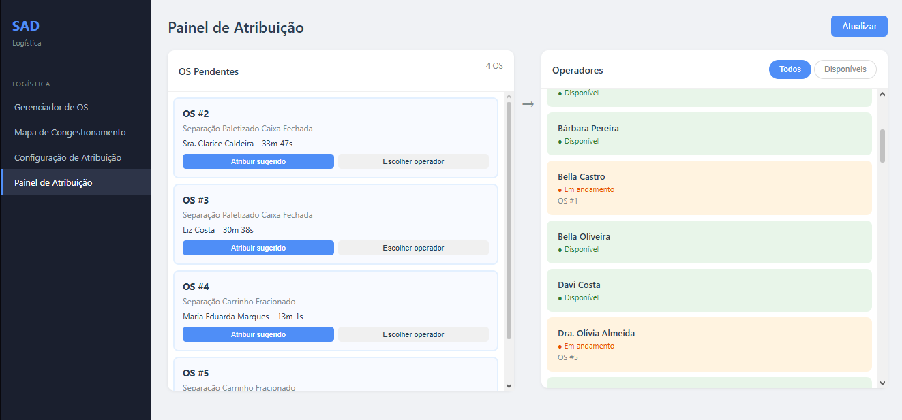
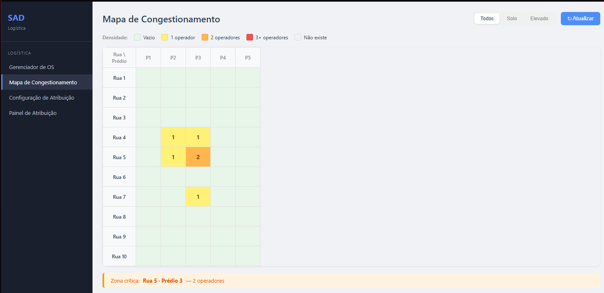
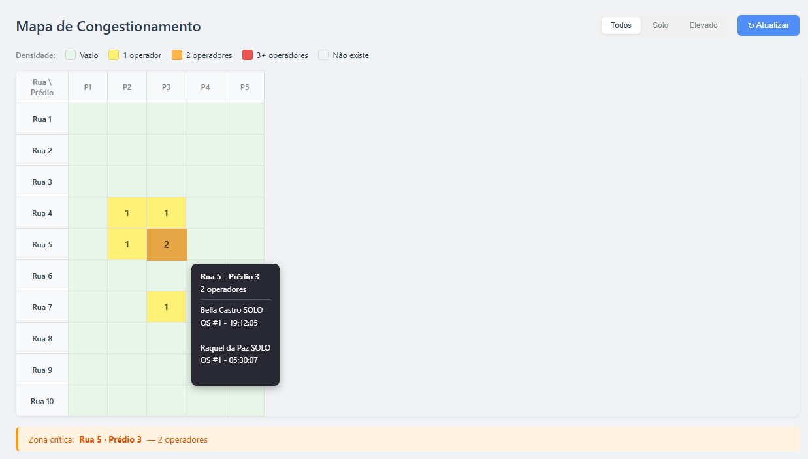
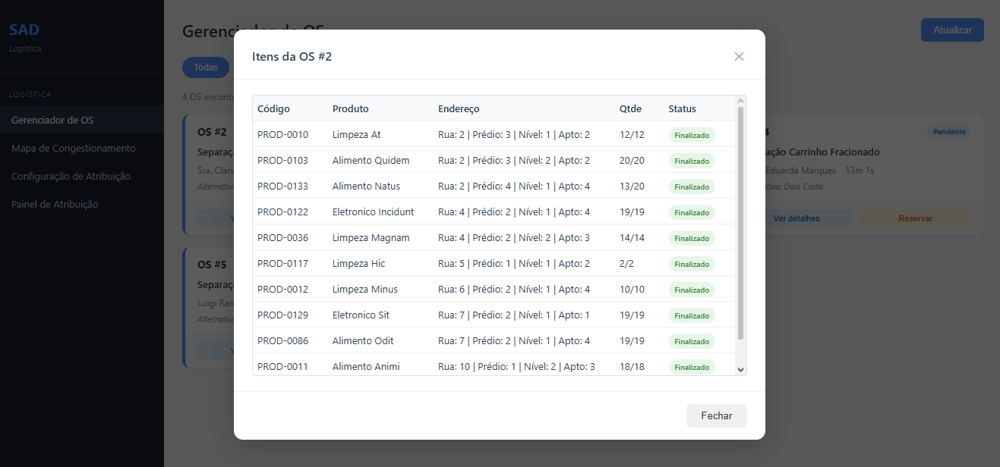
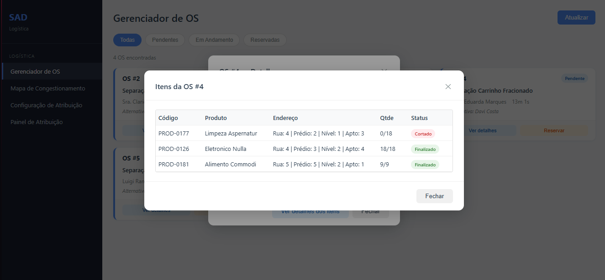
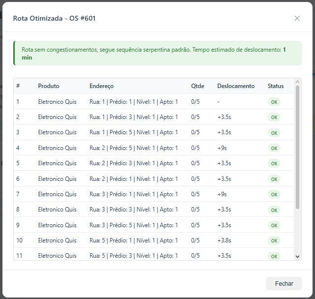
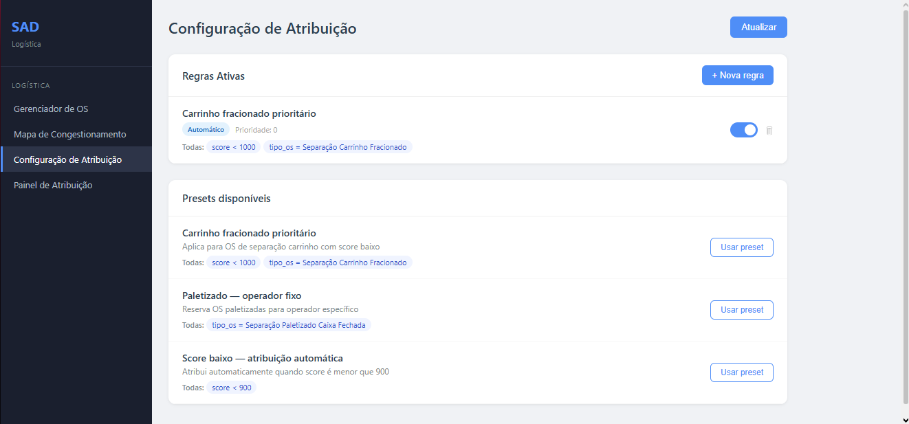
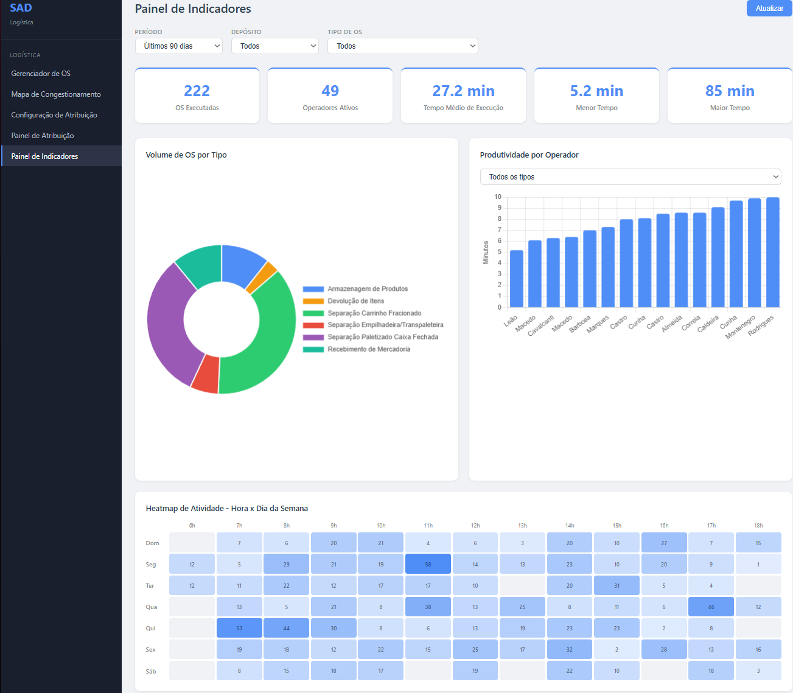
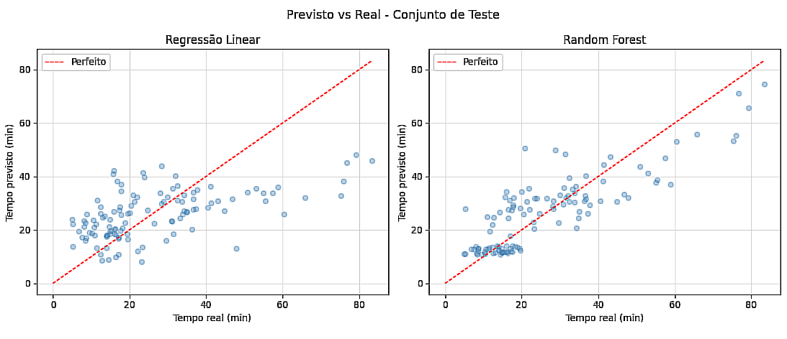
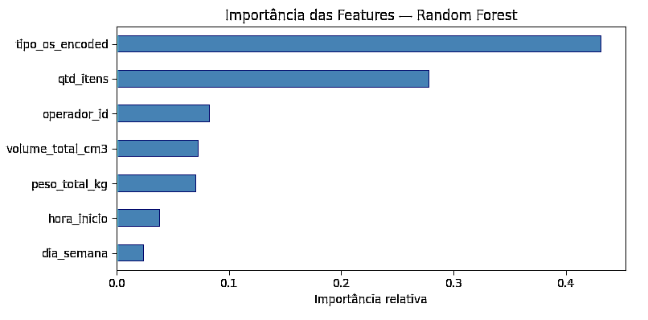

# SAD - Sistema de Apoio à Decisão para Logística Interna

> Sistema de Apoio à Decisão para otimização da atribuição de Ordens de Serviço, redução de congestionamentos operacionais e aumento da produtividade em operações logísticas.

Busca otimizar a atribuição de Ordens de Serviço (OS), reduzir congestionamentos operacionais e melhorar a produtividade dos operadores.

O projeto combina:

- Modelagem relacional em PostgreSQL
- API REST com FastAPI
- Dashboard operacional em JavaScript
- Motor de regras configurável
- Algoritmo de roteamento interno
- Machine Learning para previsão de tempo de execução
- Análise exploratória de dados

O objetivo é demonstrar a aplicação prática de Engenharia de Dados, Analytics e Ciência de Dados em um cenário logístico real.

---

## Screenshots

### Painel de Atribuição


### Mapa de Congestionamento


### Mapa com Tooltip


### Gerenciador de OS - Modal de Itens


### Gerenciador de OS - Status dos Itens


### Otimizador de rota de produtos na OS


### Configuração de Atribuição


### Painel de Indicadores Operacionais


### Modelo Preditivo - Previsto vs Real


### Modelo Preditivo - Importância das Features


---

## Problema

Em operações de separação de pedidos (picking), a atribuição de Ordens de Serviço (OS) aos operadores geralmente é feita de forma manual ou por fila simples. Isso ignora fatores críticos como:

- **Posição atual do operador** no armazém
- **Saturação de zonas** com múltiplos operadores simultâneos
- **Histórico de performance** por tipo de OS
- **Custo de congestionamento** entre operadores na mesma região

O resultado são atrasos evitáveis, gargalos e uso ineficiente da equipe.

---

## Solução

Um **SAD (Sistema de Apoio à Decisão)** que, dado um conjunto de OS pendentes e operadores disponíveis, calcula um **score de atraso esperado** para cada combinação e sugere a atribuição que minimiza o tempo total da operação.

O sistema **não decide automaticamente** - ele sugere com justificativa, mantendo o gestor no controle. A interface permite também atribuição manual com drag and drop e regras automáticas configuráveis.

---

## Arquitetura

```
sad-logistica/
│
├── schema.sql                        # Modelagem do banco PostgreSQL
├── .gitignore
│
├── dados/
│   └── gerar_dados.py                # Geração de dados sintéticos (90 dias)
│
├── docs/
│   └── screenshots/                  # Screenshots da interface
│
├── notebooks/
│   ├── 01_analise_exploratoria.ipynb # EDA completa
│   ├── 02_motor_de_score.ipynb       # Demonstração do motor de score
│   └── 03_modelo_preditivo.ipynb     # Treinamento e avaliação do modelo
│
└── src/
    ├── config.py                     # Configurações físicas do armazém
    ├── score.py                      # Motor de score v5 com modelo preditivo
    ├── regras.py                     # Motor de avaliação de regras
    ├── rota.py                       # Otimizador de ordem de produtos
    ├── api.py                        # API FastAPI
    └── static/
        ├── index.html                # Interface web SPA
        ├── style.css                 # Estilos globais
        ├── app.js                    # Navegação SPA
        └── modules/
            ├── lista_os.js           # Gerenciador de OS
            ├── mapa.js               # Mapa de congestionamento
            ├── configuracao.js       # Configuração de regras
            ├── atribuicao.js         # Painel de atribuição
            └── dashboard.js          # Painel de Indicadores
```

---

## Modelagem de Dados

O banco reflete a realidade de um armazém com dois depósitos:

| Tabela | Descrição |
|---|---|
| `depositos` | Depósito solo (térreo) e elevado (empilhadeira) |
| `os_tipos` | Tipos de OS com código numérico e escopo de métrica |
| `enderecos` | Posição física: Depósito > Rua > Prédio > Nível > Apartamento |
| `produtos` | Cadastro com dados logísticos do fabricante |
| `estoque` | Localização e quantidade de cada produto |
| `operadores` | Cadastro de operadores ativos |
| `os` | Ordens de Serviço com status e tipo |
| `os_itens` | Itens da OS com controle de quantidade por destino |
| `execucoes` | Histórico completo de atribuições e reatribuições |
| `os_reservas` | Reservas de OS para operadores específicos |
| `regras_atribuicao` | Regras de atribuição automática com condições JSONB |
| `regras_presets` | Templates reutilizáveis de regras |

### Destaques da modelagem

**Controle de quantidade por item:**
```
qt_total = qt_finalizada + qt_cortada + qt_cancelada
```
Quando essa equação fecha para todos os itens, a OS pode finalizar.

**Reatribuição rastreada:**
Cada atribuição gera uma linha em `execucoes`. Uma OS reatribuída terá duas linhas, a cancelada e a finalizada, preservando o histórico completo.

**Motor de regras flexível:**
Condições armazenadas em JSONB suportam operadores `<`, `>`, `=`, `!=` e agrupamento `all` (AND) / `any` (OR), permitindo evoluir sem alterar o schema.

---

## Motor de Score (v5)

Para cada combinação `(operador, OS pendente)`, o motor calcula:

```
score = tempo_base + custo_distancia + custo_congestao
```

**tempo_base** - previsão do modelo preditivo (Random Forest) quando disponível. Fallback para média histórica do operador por tipo de OS se o modelo não estiver disponível.

**custo_distancia** - tempo real de deslocamento em segundos, calculado com roteamento contínuo rua a rua:
- Ruas com itens: percorre os prédios até cada item e sai pelo final da rua
- Ruas sem itens: apenas o custo de travessia do corredor
- Dimensões físicas configuráveis em `config.py`

**custo_congestao** - soma do tempo restante estimado de cada operador ativo na mesma zona, baseado no tempo decorrido versus tempo médio histórico.

Regras adicionais:
- Um operador só pode ser sugerido para uma OS por rodada
- Operadores de depósito incompatível são automaticamente excluídos
- A sugestão inclui alternativa caso o gestor queira substituir
- Regras automáticas configuráveis podem sobrescrever a sugestão

---

## Modelo Preditivo

Random Forest treinado sobre 580 execuções históricas para prever o tempo de execução de uma OS antes da atribuição.

| Modelo | MAE | RMSE | R² |
|---|---|---|---|
| Regressão Linear (baseline) | 11.3 min | 14.4 min | 0.317 |
| Random Forest | 7.1 min | 9.3 min | 0.715 |

**Features utilizadas:** tipo de OS, quantidade de itens, volume total, peso total, hora do dia, dia da semana, operador.

**Features mais importantes:** tipo de OS (43.2%), quantidade de itens (27.8%), operador (8.3%).

O modelo é carregado automaticamente pelo motor de score. Se não estiver disponível, o sistema usa a média histórica como fallback sem interrupção.

---

## Interface Web

Aplicação SPA com menu lateral e navegação sem recarregar página.

### Aba 1 - Gerenciador de OS
- Cards de OS com status, sugestão, score e alternativa
- Filtros: Todas, Pendentes, Em Andamento, Reservadas
- Modal de detalhes com decomposição completa do score
- Sub-modal de itens com endereço, quantidade e status de cada item
- Sistema de reservas com badge de operador e cancelamento

### Aba 2 - Mapa de Congestionamento
- Heatmap em grade 2D: ruas x prédios
- Gradiente de cores por densidade de operadores
- Filtros: Todos, Solo, Elevado com grade unificada
- Animação pulse nas zonas críticas (3+ operadores)
- Tooltip com nome, tipo (SOLO/ELEVADO), OS e tempo de execução
- Alerta automático da zona mais crítica

### Aba 3 - Configuração de Atribuição
- Motor de regras com condições JSONB flexíveis (AND/OR)
- Presets reutilizáveis para criação rápida de regras
- Modos: automático (usa sugestão do motor) ou fixo (operador específico)
- Toggle de ativação/desativação por regra
- Prioridade configurável, primeira regra que bate ganha

### Aba 4 - Painel de Atribuição
- Cards de OS pendentes com sugestão e score
- Cards de operadores com status visual (verde/laranja/cinza)
- Drag and drop de OS para operador
- Atribuição manual com seleção de operador
- Modal de confirmação com todos os detalhes antes de gravar
- Badge de regra automática aplicada

---

## API

| Rota | Método | Descrição |
|---|---|---|
| `/os/pendentes` | GET | Retorna as ordens de serviço pendentes com sugestões de alocação e regras de negócio aplicadas. |
| `/os/reservadas` | GET | Lista as ordens de serviço atualmente reservadas para execução. |
| `/os/{id}/itens` | GET | Consulta os itens detalhados vinculados a uma ordem de serviço específica. |
| `/os/{id}/rota_otimizada` | GET | Calcula e retorna a rota otimizada de coleta, estimando deslocamento e sequência ideal de separação dos itens. |
| `/os/reservar` | POST | Realiza a reserva temporária de uma ordem de serviço para um operador. |
| `/reservar/{id}` | DELETE | Remove uma reserva ativa, liberando a ordem de serviço para nova alocação. |
| `/atribuir` | POST | Efetiva a atribuição da ordem de serviço ao operador e registra a operação no banco de dados. |
| `/operadores/disponiveis` | GET | Retorna operadores elegíveis para execução, considerando disponibilidade e localização estimada. |
| `/operadores/status` | GET | Exibe o status operacional atual dos operadores. |
| `/mapa/congestionamento` | GET | Fornece métricas de densidade operacional e congestionamento por zona do armazém. |
| `/mapa/dimensoes` | GET | Retorna as dimensões físicas e configuração do layout do armazém. |
| `/regras` | GET/POST | Consulta ou cadastra regras de negócio utilizadas pelo motor de priorização e alocação. |
| `/regras/{id}/ativo` | PATCH | Ativa ou desativa uma regra específica sem necessidade de exclusão. |
| `/regras/{id}` | DELETE | Remove uma regra de negócio cadastrada. |
| `/regras/presets` | GET | Lista conjuntos pré-configurados de regras disponíveis para aplicação. |
| `/dashboard/resumo` | GET | Retorna indicadores consolidados da operação, incluindo volume executado, produtividade e tempos médios. |
| `/dashboard/produtividade` | GET | Disponibiliza métricas de produtividade por operador e por tipo de operação. |
| `/dashboard/volume` | GET | Apresenta a distribuição e evolução do volume de ordens de serviço executadas. |
| `/dashboard/congestionamento` | GET | Retorna dados para análise de concentração operacional por horário e dia da semana, utilizados em heatmaps e indicadores de carga. |
| `/dashboard/tipo_os` | GET | Lista os tipos de ordens de serviço disponíveis para filtros e segmentação analítica. |

---

## Análise Exploratória

### Distribuição de OS por tipo
Separação Carrinho Fracionado representa ~40% do volume, seguida de Paletizado (~23%).

### Tempos médios por tipo
| Tipo | Tempo médio |
|---|---|
| Separação Carrinho Fracionado | ~15 min |
| Separação Paletizado Caixa Fechada | ~30 min |
| Armazenagem de Produtos | ~23 min |
| Separação Empilhadeira/Transpaleteira | ~40 min |
| Recebimento de Mercadoria | ~65 min |

### Qualidade dos dados
- **15 registros** com tempo suspeito detectados (< 1 min ou > 2h)
- **26.5% dos produtos** com dados logísticos provisórios

### Reatribuições
- Taxa de **11.2%** de reatribuição de OS
- Máximo de **6 operadores simultâneos** detectado por execução

---

## Limitações do modelo

- **Dados sintéticos** - padrões são controlados, não descobertos organicamente
- **Posição estimada** - sem rastreamento em tempo real, usa centroide da última OS como proxy
- **Custo de congestionamento** - em produção precisa de execuções ativas reais
- **Causalidade vs correlação** - o modelo detecta padrões, mas não isola causa com certeza
- **Sistema sugestivo** - não substitui o julgamento do gestor operacional
- **Restrição de nível por tipo de operador** - o modelo não restringe operadores solo de receberem OS com itens em níveis elevados. Em produção essa regra deve ser implementada no filtro de compatibilidade
- **Segurança** - API desenvolvida para uso local. Em produção seriam necessários autenticação JWT, rate limiting, HTTPS, CORS restritivo, validação de entidades e logs de auditoria

---

## Tecnologias

- **PostgreSQL** - banco de dados relacional
- **Python** - geração de dados, análise, motor de score e API
- **FastAPI** - API REST com documentação automática
- **scikit-learn** - modelo preditivo Random Forest
- **pandas** - manipulação de dados
- **matplotlib / seaborn** - visualizações
- **SQLAlchemy / psycopg** - conexão Python com PostgreSQL
- **Jupyter Notebook** - análise exploratória documentada
- **HTML / CSS / JavaScript** - interface web SPA sem frameworks

---

## Como rodar

### 1. Banco de dados
```bash
# No pgAdmin, crie o banco sad_logistica e execute:
psql -U postgres -d sad_logistica -f schema.sql
```

### 2. Dependências Python
```bash
pip install psycopg[binary] pandas matplotlib seaborn sqlalchemy faker jupyter python-dotenv fastapi uvicorn scikit-learn joblib
```

### 3. Variáveis de ambiente
Crie um arquivo `.env` na raiz do projeto:
```
DB_USER=postgres
DB_PASSWORD=sua_senha
DB_HOST=localhost
DB_PORT=5433
DB_NAME=sad_logistica
```

### 4. Gerar dados sintéticos
```bash
python dados/gerar_dados.py
```

### 5. Treinar o modelo preditivo
```bash
jupyter notebook notebooks/03_modelo_preditivo.ipynb
```
Execute todas as células para gerar os arquivos em `src/modelo/`.

### 6. Interface web
```bash
cd src
uvicorn api:app --reload
```
Acesse `http://localhost:8000`

### 7. Motor de score (standalone)
```bash
python src/score.py
```

---

## Roadmap

### Fase 1 - Fundação (concluída)
- [x] Modelagem do banco de dados
- [x] Geração de dados sintéticos com problemas de qualidade propositais
- [x] Análise exploratória completa
- [x] Motor de score v1 (tempo base + distância + congestionamento)

### Fase 2 - Motor de score melhorado (concluída)
- [x] Congestionamento dinâmico com vw_operadores_ativos
- [x] Distância real por item com dimensões físicas do armazém
- [x] Roteamento contínuo rua a rua com custo de travessia real
- [x] Alocação única por rodada
- [x] Apresentação de tempo em formato legível
- [x] Configurações do armazém externalizadas em config.py
- [x] Notebook documentado do motor de score

### Fase 3 - Interface (concluída)
- [x] API FastAPI com rotas completas
- [x] Gerenciador de OS com filtros, reservas e detalhes de itens
- [x] Mapa de congestionamento com heatmap e filtros por depósito
- [x] Configuração de regras automáticas com presets e JSONB
- [x] Painel de atribuição com drag and drop e confirmação

### Fase 4 - Modelo preditivo (concluída)
- [x] Regressão linear como baseline preditivo
- [x] Random Forest para capturar não-linearidades
- [x] Avaliação e comparação de modelos (RMSE, MAE, R²)
- [x] Notebook documentado com análise de features e visualizações
- [x] Integração da previsão no motor de score com fallback automático

### Fase 5 - Melhorias futuras
- [x] Otimização da ordem de coleta dentro da OS para mitigação de gargalo
- [x] Dashboard de indicadores históricos
- [ ] Autenticação de usuários e perfis de acesso
- [ ] Restrição de nível por tipo de operador no motor

---

## Autor

Projeto desenvolvido como estudo de otimização logística e ciência de dados aplicada a operações de armazém.